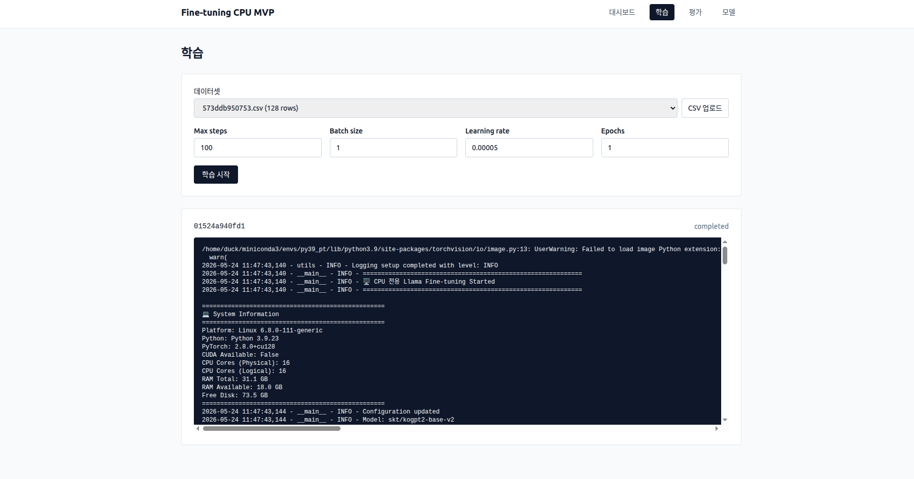

# Fine-tuning CPU MVP

> 한국어 KoGPT2 모델을 **CPU만으로** LoRA 파인튜닝하고, FastAPI + React 기반 웹 UI에서 학습·관리·추론까지 한 번에 수행할 수 있는 단일 사용자 MVP. 도메인 예제는 **한국 민법(부동산·전세) Q&A** 입니다.



위 캡처는 `학습` 페이지에서 업로드된 데이터셋(`573ddb950753.csv, 128 rows`)으로 `max_steps=100 / batch_size=1 / lr=5e-5 / epochs=1` 설정의 작업을 실행한 모습입니다. 잡 ID `01524a940fd1` 가 `completed` 로 종료되었고, 우측 로그 패널은 백엔드가 SSE 로 실시간 스트리밍한 학습 stdout(시스템 정보 → `skt/kogpt2-base-v2` 로드 단계)을 그대로 보여줍니다.

---

## ✨ 주요 특징

- **GPU 불필요**: CPU 전용 PyTorch + LoRA(`r=8`, target `c_attn`/`c_proj`) + `gradient_accumulation=32` 로 노트북·서버 어디서나 실행.
- **풀스택 MVP**:
  - **Backend** — FastAPI 0.115 + uvicorn. 데이터셋·모델·학습잡·추론 4개 라우터.
  - **Frontend** — React 18 + Vite 5 + TypeScript + Tailwind 3.4 (Node 18 핀).
  - **CLI 보존** — `main_train_cpu.py` / `main_inference_cpu.py` 는 그대로 살아있어 단독 실행도 가능.
- **실시간 학습 로그**: 학습은 별도 프로세스(`subprocess.Popen`)로 띄우고, 로그 파일을 `text/event-stream` 으로 푸시 (`EventSource`).
- **단일 origin 배포**: `npm run build` 결과물을 FastAPI 가 `StaticFiles` 로 마운트하여 API+SPA 동시 서빙.
- **로컬 완결**: 외부 API 의존 없음. 모든 산출물은 `backend/storage/{datasets,models,logs}/` 에 저장.

---

## 📁 프로젝트 구조

```
fine_tuning_cpu_base_model/
├── backend/
│   ├── app/                      # FastAPI 얇은 서빙 레이어
│   │   ├── main.py               # 앱 엔트리·CORS·라우터·StaticFiles
│   │   ├── config.py             # 스토리지 경로
│   │   ├── schemas.py            # Pydantic DTO
│   │   ├── routes/               # datasets / train / models / infer
│   │   └── services/             # job_store(메모리), train_runner(subprocess)
│   ├── main_train_cpu.py         # CLI 학습 엔트리 (subprocess 가 실행)
│   ├── main_inference_cpu.py     # CLI 추론 엔트리
│   ├── model_manager_cpu.py      # CPUModelManager / InferenceModelManager
│   ├── data_loader.py            # CSV → tokenized Dataset
│   ├── trainer.py                # TrainingManager (HF Trainer)
│   ├── inference_manager.py      # InferenceManager / ChatBot
│   ├── config_cpu.py             # ModelConfig / LoRAConfig / TrainingConfig
│   ├── utils.py                  # 공통 로깅/검증/진행률
│   ├── requirements_cpu_py39.txt # 학습/추론 코어 의존성
│   ├── requirements_api.txt      # FastAPI 레이어 추가 의존성
│   └── storage/                  # 런타임 산출물 (gitignored)
│       ├── datasets/  <dataset_id>.csv
│       ├── models/    <job_id>/   ← LoRA 어댑터 + tokenizer
│       └── logs/      <job_id>.log
├── frontend/                     # React + Vite + TS + Tailwind
│   ├── src/
│   │   ├── App.tsx               # 라우팅·헤더
│   │   ├── api/client.ts         # fetch 래퍼 + SSE 헬퍼
│   │   └── pages/                # Dashboard · Train · Evaluate · Models
│   └── package.json              # Node 18 핀
├── docs/
│   ├── ARCHITECTURE.md           # 레이어·데이터 플로우·API 표
│   └── UML.md                    # Mermaid 컴포넌트/클래스/시퀀스/상태도
├── demo.png                      # 메인 캡처 (위 이미지)
└── README.md                     # 본 문서
```

> 자세한 레이어 구조·데이터 플로우는 [`docs/ARCHITECTURE.md`](docs/ARCHITECTURE.md), 다이어그램은 [`docs/UML.md`](docs/UML.md) 참고.

---

## 💻 시스템 요구사항

| 항목 | 권장 |
| --- | --- |
| OS | Linux / macOS / Windows |
| Python | **3.9** (Conda env 권장, 예: `py39_pt`) |
| Node.js | **18.x** (`.nvmrc` 고정) |
| RAM | 16 GB 이상 (32 GB 권장) |
| 디스크 | 20 GB 이상 여유 공간 |
| GPU | **불필요** (있어도 사용하지 않음 — `CUDA_VISIBLE_DEVICES=""` 강제) |

> ⚠️ CPU 학습은 느립니다. `max_steps=100` 기준 KoGPT2 + LoRA 가 수 분 ~ 수십 분. 본격 학습보다 **워크플로우 검증·파인튜닝 데모** 용도에 적합합니다.

---

## 📦 설치

### 1) 백엔드 (Python 3.9)

```bash
# Conda 예시
conda create -n py39_pt python=3.9 -y
conda activate py39_pt

# CPU 전용 PyTorch
pip install torch torchvision torchaudio --index-url https://download.pytorch.org/whl/cpu

# 학습/추론 코어 + FastAPI 레이어
cd backend
pip install -r requirements_cpu_py39.txt
pip install -r requirements_api.txt
```

### 2) 프론트엔드 (Node 18)

```bash
cd frontend
nvm use            # .nvmrc → 18
npm install
```

---

## 🚀 실행

### 개발 모드 (2개 프로세스)

```bash
# 터미널 A — 백엔드
cd backend
uvicorn app.main:app --reload --port 8000

# 터미널 B — 프론트엔드
cd frontend
npm run dev        # http://localhost:5173
```

Vite dev 서버가 5173 에서 뜨고 백엔드 `:8000/api/*` 로 호출합니다. CORS 는 `localhost:5173` 에 대해 허용됩니다.

### 단일 origin 배포 모드

```bash
cd frontend && npm run build       # → frontend/dist/
cd ../backend && uvicorn app.main:app --port 8000
# http://localhost:8000  ← SPA + API 동시 서빙
```

`app.main` 이 `frontend/dist` 존재를 감지하면 `/` 에 `StaticFiles` 로 마운트합니다.

### CLI 단독 실행 (UI 없이)

```bash
cd backend

# 학습
python main_train_cpu.py \
  --csv_path civil_law_qa_extended.csv \
  --output_dir ./fine_tuned_model_cpu \
  --max_steps 100 --batch_size 1 --learning_rate 5e-5

# 대화형 추론
python main_inference_cpu.py --model_path ./fine_tuned_model_cpu --interactive

# 단일 질문
python main_inference_cpu.py --model_path ./fine_tuned_model_cpu \
  --question "전세권이란 무엇인가요?"
```

---

## 🖥️ 웹 UI 사용 흐름

| 페이지 | 역할 |
| --- | --- |
| **대시보드** | 최근 학습 잡 5건, 저장된 모델 5건 요약 |
| **학습** | CSV 업로드 → 하이퍼파라미터 입력 → `학습 시작` → 실시간 로그 SSE 스트림 → 완료 시 `completed` 배지 (위 데모 캡처와 동일) |
| **평가** | 모델 선택 + 질문 입력 → `POST /api/infer` 호출 (모델은 첫 호출 후 메모리 캐시) → 답변과 `elapsed_ms` 표시 |
| **모델** | 저장된 LoRA 어댑터 목록 / 삭제 |

---

## 🔌 주요 API

| Method | Path | 설명 |
| --- | --- | --- |
| `GET`  | `/api/health` | liveness |
| `GET`  | `/api/datasets` | 데이터셋 목록 |
| `POST` | `/api/datasets/upload` | CSV 업로드 (multipart, `question`/`answer` 컬럼 필수) |
| `DELETE` | `/api/datasets/{id}` | 데이터셋 삭제 |
| `POST` | `/api/train` | 학습 시작 (동시 1개 제한, 409) |
| `GET`  | `/api/train/jobs` | 잡 목록 |
| `GET`  | `/api/train/jobs/{id}` | 잡 상태 조회 |
| `POST` | `/api/train/jobs/{id}/stop` | SIGTERM 으로 학습 중단 |
| `GET`  | `/api/train/jobs/{id}/stream` | SSE 로그 스트림 (`event: end` 로 종료) |
| `GET`  | `/api/models` | 어댑터 보유 디렉터리 목록 |
| `DELETE` | `/api/models/{id}` | 모델 삭제 (`rmtree`) |
| `POST` | `/api/infer` | 질의응답 (`{model_id, question, max_new_tokens, temperature}`) |

> 자세한 시퀀스·상태 전이 다이어그램은 [`docs/UML.md`](docs/UML.md) 의 §5–§8 참고.

---

## 📊 데이터셋 형식

UTF-8 CSV 파일이며 다음 두 컬럼이 **필수**입니다.

| 컬럼 | 필수 | 설명 |
| ------ | ------ | ------ |
| `question` | ✅ | 질문 |
| `answer`   | ✅ | 정답 |
| (기타)     | ❌ | category 등은 무시됨 |

업로드 시점에 처음 5행을 검증하여 누락된 컬럼이 있으면 400 으로 반환됩니다. 학습 시에는 `format_prompt()` 가 다음과 같이 변환합니다.

```text
질문: {question}
답변: {answer}</s>
```

---

## ⚙️ 핵심 설정 (`backend/config_cpu.py`)

| 그룹 | 키 | 기본값 |
| --- | --- | --- |
| Model | `model_name` | `skt/kogpt2-base-v2` |
| Model | `max_length` | 256 |
| Model | `torch_dtype` | `float32` |
| LoRA  | `r` / `lora_alpha` / `dropout` | 8 / 16 / 0.1 |
| LoRA  | `target_modules` | `["c_attn", "c_proj"]` |
| Train | `batch_size` / `gradient_accumulation_steps` | 1 / 32 |
| Train | `learning_rate` / `max_steps` / `epochs` | 5e-5 / 100 / 1 |
| Train | `fp16` / `gradient_checkpointing` | False / False (CPU 강제) |
| Infer | `max_new_tokens` / `temperature` / `top_p` | 256 / 0.8 / 0.9 |

---

## 🧠 모델·LoRA 개요

- **베이스 모델**: [`skt/kogpt2-base-v2`](https://huggingface.co/skt/kogpt2-base-v2) — 한국어 GPT-2 (~125M params).
- **LoRA 어댑터**: HF PEFT 로 `c_attn`, `c_proj` 에 부착, 학습 가능 파라미터를 수십만 수준으로 압축.
- **추론 시**: base model 을 로드한 뒤 `PeftModel.from_pretrained(base, adapter_path)` 로 어댑터 결합. 모델은 라우터 내 `_cache` 에 `model_id` 키로 캐싱됩니다.

---

## 🔧 트러블슈팅

| 증상 | 원인/대처 |
| --- | --- |
| `409 Another training job is already running` | 동시 학습 1개 제한. 진행 중 잡을 `학습` 페이지에서 중단하거나 종료 대기 |
| 학습은 끝났는데 모델이 안 보임 | `storage/models/<job_id>/adapter_config.json` 존재 여부 확인 (없으면 학습이 어댑터 저장 직전에 실패한 것) |
| 추론에서 옛 모델 응답이 그대로 나옴 | 같은 `model_id` 캐시 잔존. 백엔드 재기동(`uvicorn`) 으로 캐시 초기화 |
| 토크나이저 경고 (`pad_token`) | KoGPT2 는 기본 `pad_token` 이 없어 코드에서 `eos_token` 으로 설정 — 무시 가능 |
| CPU 학습 너무 느림 | `--max_steps 50` 등으로 감소 / 작은 CSV 로 우선 워크플로우 검증 |
| 모듈 import 오류 | `requirements_cpu_py39.txt` + `requirements_api.txt` 둘 다 설치했는지 확인 |

학습 로그는 두 곳에서 확인 가능합니다.

- `backend/storage/logs/<job_id>.log` (백엔드가 작성)
- `backend/training_cpu_YYYYMMDD_HHMMSS.log` (CLI 단독 실행 시 추가 생성)

---

## 📚 추가 문서

- [`docs/ARCHITECTURE.md`](docs/ARCHITECTURE.md) — 레이어·플로우·API·동시성 모델
- [`docs/UML.md`](docs/UML.md) — Mermaid 다이어그램 10종 (컴포넌트·클래스·시퀀스·상태·액티비티·배포)

---

## 📝 라이선스

[LICENSE](LICENSE) 참조.
