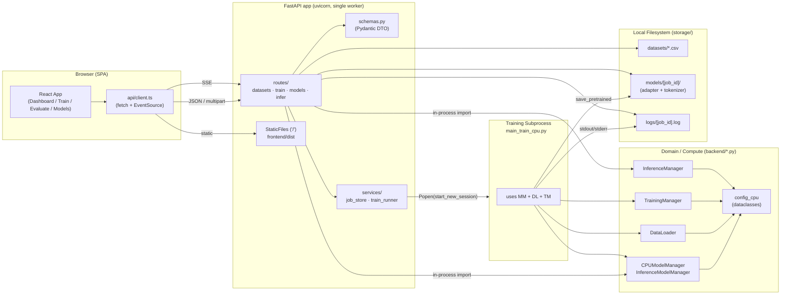
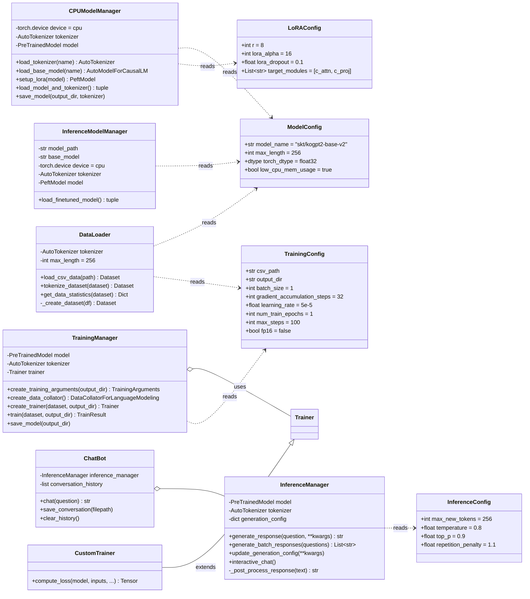
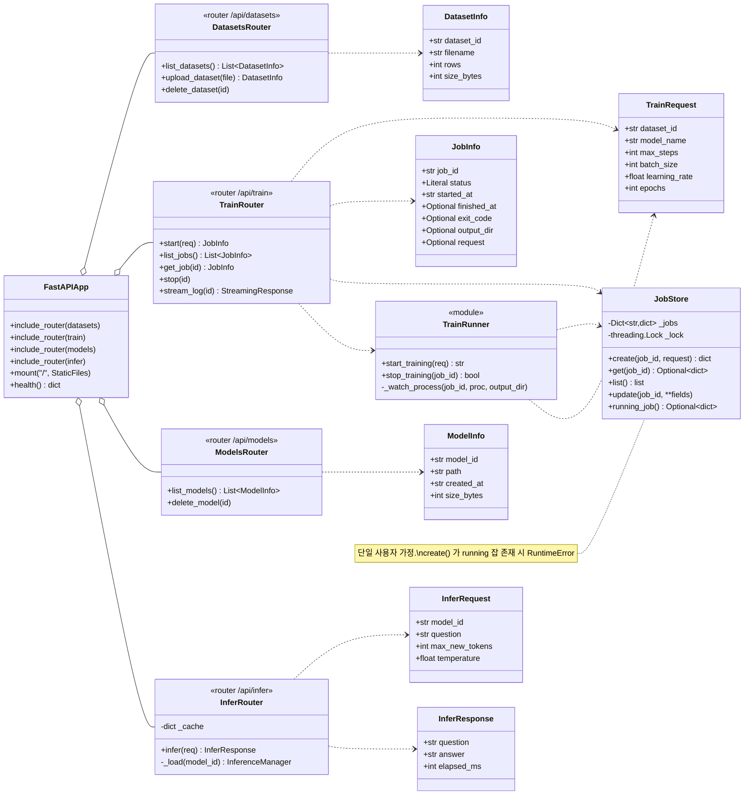
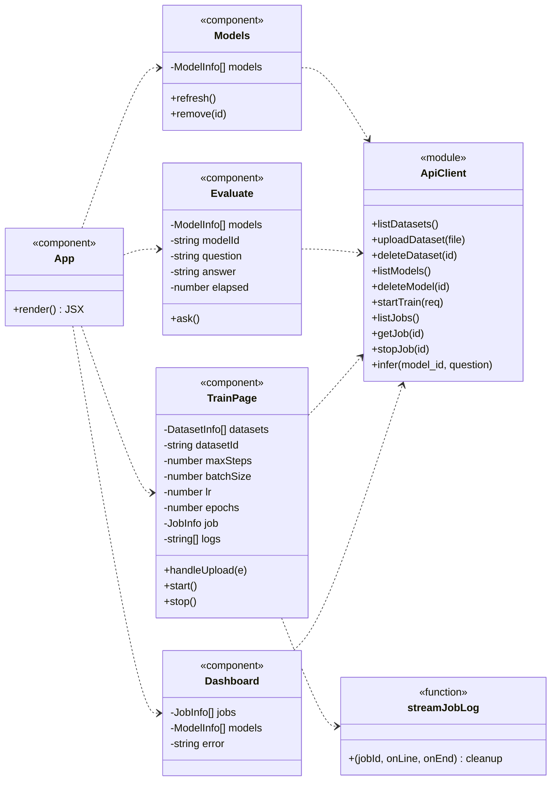
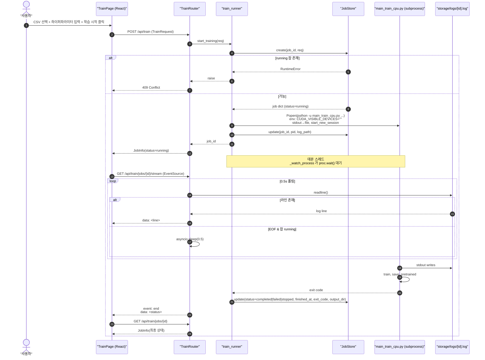
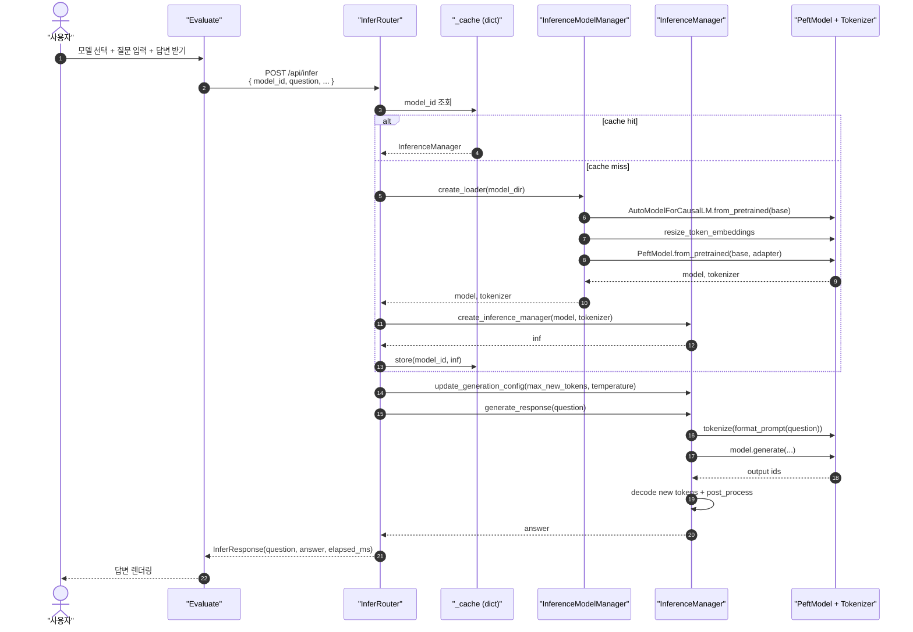
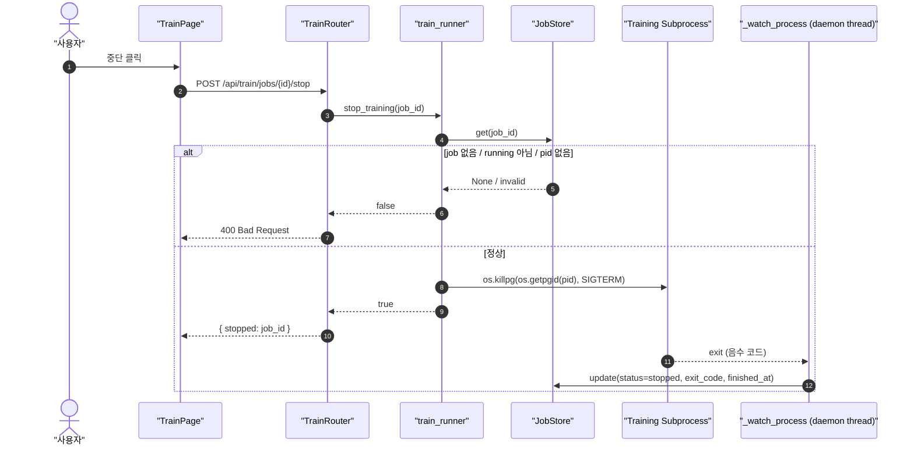
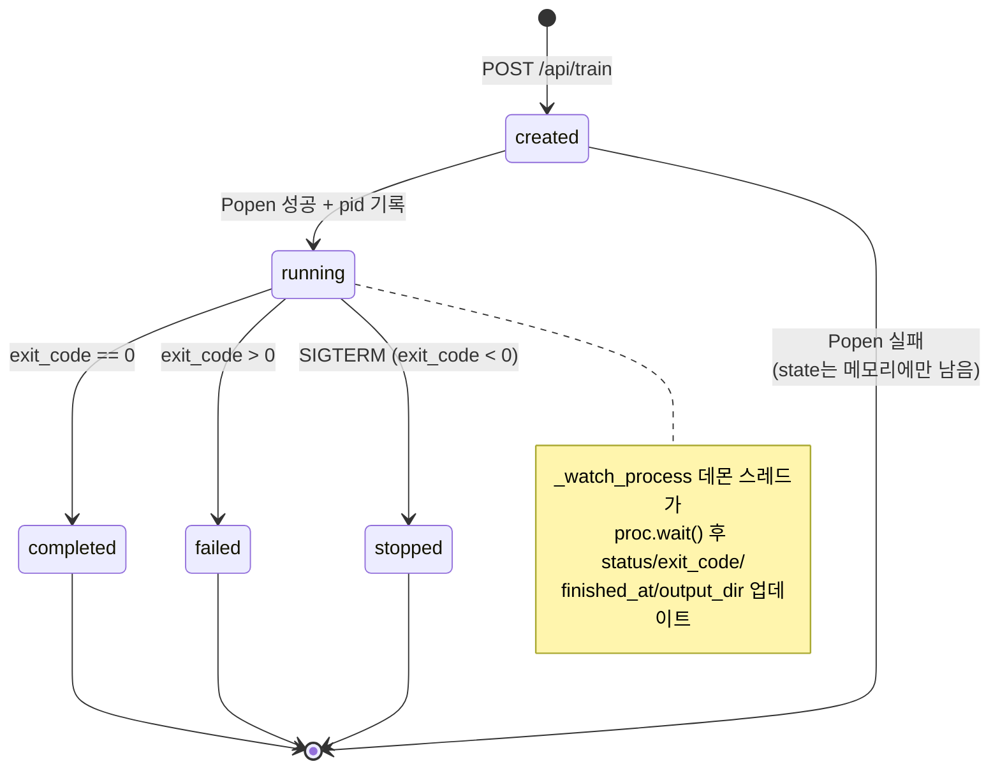
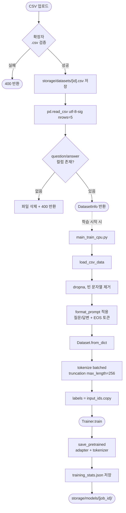
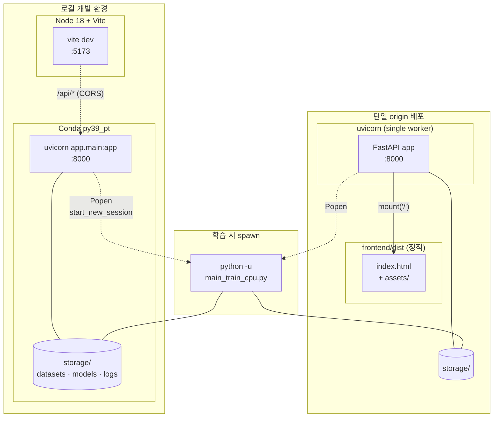

# UML 다이어그램

> 본 문서는 Fine-tuning CPU MVP 의 정적/동적 구조를 [Mermaid](https://mermaid.js.org/) 표기법으로 정리한다. GitHub·VSCode·IntelliJ 등 대부분의 마크다운 뷰어에서 직접 렌더링된다.

목차
- [1. 컴포넌트 다이어그램](#1-컴포넌트-다이어그램)
- [2. 클래스 다이어그램 — 백엔드 도메인](#2-클래스-다이어그램--백엔드-도메인)
- [3. 클래스 다이어그램 — API/서비스 레이어](#3-클래스-다이어그램--api서비스-레이어)
- [4. 클래스 다이어그램 — 프론트엔드](#4-클래스-다이어그램--프론트엔드)
- [5. 시퀀스 다이어그램 — 학습 시작 + SSE 로그](#5-시퀀스-다이어그램--학습-시작--sse-로그)
- [6. 시퀀스 다이어그램 — 추론](#6-시퀀스-다이어그램--추론)
- [7. 시퀀스 다이어그램 — 학습 중단](#7-시퀀스-다이어그램--학습-중단)
- [8. 상태 다이어그램 — Job 라이프사이클](#8-상태-다이어그램--job-라이프사이클)
- [9. 액티비티 다이어그램 — 데이터 처리 파이프라인](#9-액티비티-다이어그램--데이터-처리-파이프라인)
- [10. 배포 다이어그램](#10-배포-다이어그램)

---

## 1. 컴포넌트 다이어그램

---

## 2. 클래스 다이어그램 — 백엔드 도메인

---

## 3. 클래스 다이어그램 — API/서비스 레이어

---

## 4. 클래스 다이어그램 — 프론트엔드

---

## 5. 시퀀스 다이어그램 — 학습 시작 + SSE 로그

---

## 6. 시퀀스 다이어그램 — 추론

---

## 7. 시퀀스 다이어그램 — 학습 중단

---

## 8. 상태 다이어그램 — Job 라이프사이클

---

## 9. 액티비티 다이어그램 — 데이터 처리 파이프라인

---

## 10. 배포 다이어그램

